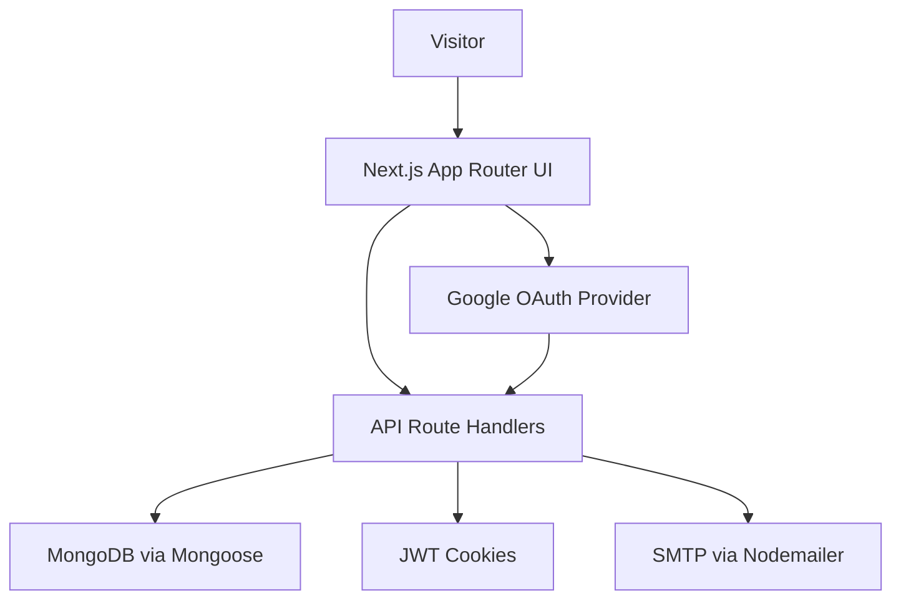
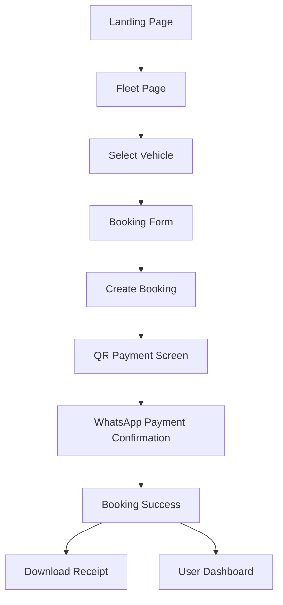
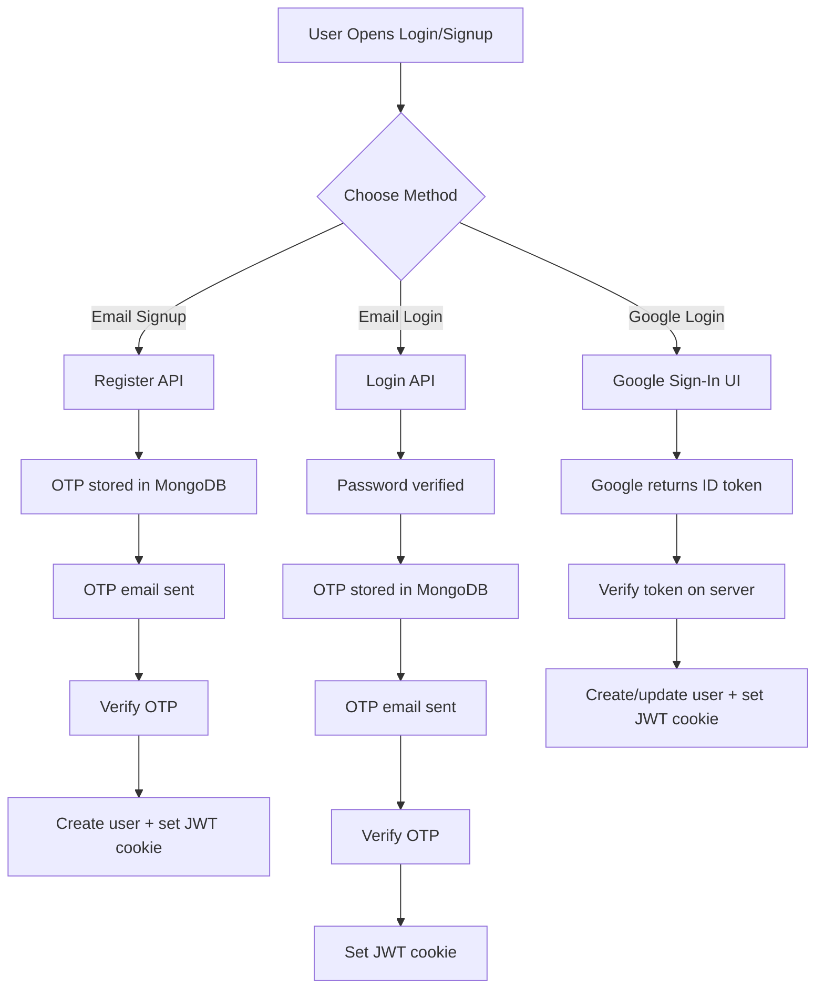
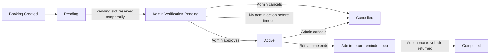

# STM Riders

STM Riders is a full-stack vehicle rental platform built with Next.js, MongoDB, and JWT-based authentication. It lets users browse cars, bikes, and scooties, create bookings, apply coupons, verify login/signup with email OTP, sign in with Google, complete payment through QR flow, and download booking receipts. It also includes an admin panel for managing vehicles, bookings, coupons, and business metrics.

## What This Website Does

The website is a rental platform for:

- Cars
- Bikes
- Scooties

It supports:

- public landing pages and fleet browsing
- secure user signup/login
- Google authentication
- email OTP verification
- protected user dashboard
- booking creation with duration-based pricing
- coupon validation
- QR payment guidance
- PDF receipt generation
- admin management tools

## Main Features

### Public/User Features

- Responsive homepage with hero, offers, fleet showcase, trust/value sections, and footer
- Fleet listing page with:
  - search
  - type filter
  - live availability badges
  - tier-based pricing display
- Vehicle booking page with:
  - real-time booking calendar per vehicle
  - date cells showing available, partially busy, and fully blocked days
  - clickable day selection that snaps pickup date
  - package selection or custom date range
  - automatic duration calculation
  - client-side blocked-slot feedback before submit
  - server-side price validation
  - overlap/concurrency protection for same vehicle slot
  - coupon application
  - document upload
  - payment QR step
  - WhatsApp payment confirmation
  - admin verification pending state
  - confirmation email after approval
  - downloadable receipt PDF after approval
- User authentication:
  - email/password signup with OTP verification
  - email/password login with OTP verification
  - Google login/signup
  - improved responsive Google sign-in button on mobile auth screens
- User dashboard:
  - view active, pending, completed, and cancelled bookings
  - download booking receipts
  - update profile details
  - change password

### Admin Features

- Admin login
- Dashboard analytics:
  - total revenue
  - total bookings
  - active rentals
  - total vehicles
  - weekly/monthly/yearly earnings
  - charts using Recharts
- Vehicle management:
  - create vehicle
  - edit vehicle
  - delete vehicle
  - change status
  - emergency reset all vehicles to available
- Booking management:
  - approve pending bookings
  - mark bookings completed
  - cancel bookings
  - view uploaded customer ID proofs
  - approve/reject directly from admin email
  - receive hourly vehicle return reminder emails after rental end time
- Coupon management:
  - create coupon
  - activate/deactivate coupon
  - delete coupon

## Tech Stack

### Frontend

- Next.js 15 App Router
- React 19
- Tailwind CSS 4
- Lucide React icons
- GSAP
- Recharts

### Backend

- Next.js Route Handlers
- MongoDB
- Mongoose

### Authentication / Security

- JWT via `jose`
- bcryptjs for password hashing
- Google OAuth via `@react-oauth/google`
- Google ID token verification via `google-auth-library`
- OTP verification via MongoDB + Nodemailer

### Utility / Export / Analytics

- jsPDF for receipt download
- html2canvas dependency available
- Vercel Analytics

## High-Level Architecture



## Website Flow

### Full User Journey



### Authentication Flow



### Booking Status Lifecycle



## Project Structure

```text
src/
  app/
    api/
      admin/
      auth/
      bookings/
      coupons/
      user/
      vehicles/
    admin/
    book/[id]/
    dashboard/
    login/
    signup/
    vehicles/
    about/
    contact/
  components/
  lib/
  models/
  middleware.js
public/
  images/
  videos/
```

## Important Pages

### Public Pages

- `/`
  - homepage
  - uses `Hero`, `OffersBanner`, `VehicleShowcase`, `WhyChooseUs`, `Footer`
- `/vehicles`
  - complete fleet listing
  - filtering by type
  - searching by name
- `/about`
  - brand/about page
- `/contact`
  - contact information

### Auth Pages

- `/login`
  - email/password login
  - OTP verification step
  - Google sign-in
- `/signup`
  - email/password signup
  - OTP verification step
  - Google sign-up

### Protected User Pages

- `/book/[id]`
  - booking form and payment flow
- `/dashboard`
  - user account area
  - bookings + settings

### Admin Pages

- `/admin/login`
  - admin authentication
- `/admin`
  - admin dashboard analytics
- `/admin/vehicles`
  - manage inventory
- `/admin/bookings`
  - manage booking state
- `/admin/coupons`
  - manage discounts

## Authentication Logic

### Local Signup

1. User enters name, email, password
2. `POST /api/auth/register`
3. Server validates data
4. Password is hashed with bcrypt
5. OTP document is created in MongoDB
6. OTP email is sent through SMTP
7. User enters OTP
8. `POST /api/auth/verify-otp` with `purpose: register`
9. User document is created
10. JWT is created and stored in `user_token` cookie

### Local Login

1. User enters email and password
2. `POST /api/auth/login`
3. Server checks user
4. Server compares bcrypt password hash
5. OTP document is created for login
6. OTP email is sent
7. User enters OTP
8. `POST /api/auth/verify-otp` with `purpose: login`
9. JWT is created and stored in cookie

### Google Login

1. Frontend renders `GoogleOAuthProvider`
2. Login/signup page uses `GoogleLogin`
3. Google returns ID token credential
4. Frontend posts credential to `POST /api/auth/google`
5. Server verifies ID token using `google-auth-library`
6. If user does not exist:
   - create user with `authProvider: google`
7. If user exists:
   - update provider fields
8. Server creates JWT and sets cookie

### Session Storage

- user authentication is stored in `user_token`
- admin authentication is stored in `admin_token`
- both are HTTP-only cookies

## Route Protection Logic

`src/middleware.js` protects:

- `/dashboard`
- `/book/*`
- `/admin/*`

Rules:

- unauthenticated users are redirected to `/login`
- authenticated users cannot revisit `/login` or `/signup`
- admin routes require `admin_token`

## Booking Logic

### Booking Creation Rules

When user submits booking:

1. Vehicle is fetched by ID
2. Vehicle must exist
3. Vehicle must not be under maintenance
4. Booking page first shows a live availability calendar for the selected vehicle
5. Frontend highlights open, partially busy, and blocked dates
6. Package buttons are disabled when they overlap a blocked range for the chosen pickup time
7. Server recalculates or validates price
8. Coupon is validated again server-side
9. Server checks for overlapping active or still-valid pending bookings
10. Booking is saved with `Pending` status
11. A temporary slot lock is created for that exact vehicle/time window
12. Admin notification email is sent
13. Vehicle is still not marked `Busy` yet

### Booking Data Includes

- vehicle reference
- optional user reference
- customer name
- phone
- start date
- end date
- duration hours
- total price
- original price
- coupon code
- uploaded ID proofs
- booking status
- verification expiry timestamp
- approval timestamp
- slot key for concurrency protection
- customer email

### Payment Flow Logic

The current payment flow is:

1. Booking is created first
2. User sees QR payment screen
3. User pays externally through QR
4. User taps WhatsApp confirmation button
5. Admin receives an email with approve/reject links
6. Booking stays in `Admin Verification Pending`
7. Admin can approve from email or from the admin panel
8. Only after approval:
   - booking moves from `Pending` to `Active`
   - vehicle becomes `Busy`
   - customer gets confirmation email
   - receipt PDF is attached to the email
9. If admin does not approve in time, the pending slot auto-expires and releases the vehicle window
10. After rental end time:
   - vehicle does not become available automatically
   - admin gets hourly reminder emails
   - admin must confirm the vehicle has actually been returned
   - only then does booking move to `Completed` and vehicle becomes `Available`

This means payment is currently semi-manual, not gateway-automated.

### Calendar Availability Logic

The vehicle booking page now includes a real-time availability calendar:

1. Frontend requests `GET /api/vehicles/[id]/availability`
2. Server returns:
   - blocked booking ranges
   - day-by-day summaries for the next booking window
3. Calendar shows each date as:
   - available
   - partially busy
   - fully blocked
4. User can only click valid future dates
5. When a date is selected:
   - pickup day is auto-filled
   - selected day detail is shown below the grid
6. Package options are checked against the selected pickup time
7. Custom drop-off selections are also checked against blocked windows
8. Final server-side conflict check still runs during booking creation

This gives users a visual slot selector while still keeping the backend as the final source of truth.

### Auto Expiry Logic

Inside booking cleanup logic:

- stale pending bookings whose admin verification window expired are cancelled automatically
- active bookings stay active after rental end until admin confirms vehicle return

This keeps temporary slot locks from living forever while still preventing vehicles from becoming available too early.

### Vehicle Return Reminder Logic

To make sure a vehicle is physically returned before it becomes available again:

1. Active booking reaches its drop-off time
2. Booking stays `Active`
3. Vehicle remains `Busy`
4. System sends hourly reminder emails to admin
5. Admin can confirm return from:
   - admin portal
   - email action link
6. Once admin confirms return:
   - booking becomes `Completed`
   - vehicle becomes `Available`
   - reminder emails stop

This prevents vehicles from becoming available again only because time passed on paper.

### Concurrency Protection Logic

To prevent two users from booking the same vehicle for the same time:

1. Server calculates `startDate` and `endDate`
2. Server checks existing bookings for overlapping windows
3. Conflicts are checked against:
   - `Active` bookings
   - still-valid `Pending` bookings
4. A `slotKey` is stored per exact vehicle/time slot
5. Even if two requests arrive close together, duplicate slot creation is blocked at database level

This ensures one time slot can only be reserved by one booking at a time.

## Coupon Logic

Coupon model supports:

- unique uppercase code
- percentage discount
- usage limit
- used count
- active/inactive state

Coupon validation flow:

1. User enters coupon on booking page
2. Frontend calls `POST /api/coupons/validate`
3. If valid, discount is shown in UI
4. During booking creation, coupon is checked again server-side
5. `usedCount` increments after successful booking

## Receipt Logic

Receipts are generated using `jsPDF`.

Receipt includes:

- booking ID
- customer info
- vehicle info
- pickup and drop-off time
- duration
- total paid
- booking status

Receipts can be downloaded:

- after booking success
- later from dashboard

## Dashboard Logic

The user dashboard has two main tabs:

- My Bookings
- Settings

### My Bookings

Bookings are separated into:

- `Pending`
- `Active`
- past bookings (`Completed` and `Cancelled`)

### Settings

User can update:

- name
- email
- password

Password update rules:

- current password is required
- current password must match bcrypt hash
- new password must be at least 6 characters

## Admin Logic

### Admin Login

There are two admin access paths:

- legacy hardcoded admin fallback
- whitelisted email from database-backed user account

Current whitelist includes:

- `akshattiwari6939@gmail.com`

### Admin Dashboard

Admin dashboard fetches:

- all bookings
- all vehicles

It calculates:

- total revenue
- total bookings
- active rentals
- total vehicles
- earnings in the last 7 days
- current month earnings
- current year earnings
- monthly revenue chart
- yearly revenue chart

### Admin Booking Management

Admin can:

- confirm pending booking to `Active`
- mark active booking as `Completed`
- cancel pending/active booking

If booking becomes `Completed` or `Cancelled`:

- vehicle is restored to `Available`
- but only if no other active booking is using it

### Admin Vehicle Management

Admin can:

- add vehicle
- edit vehicle
- delete vehicle
- change vehicle status manually

Vehicle pricing uses tiered pricing by duration, not just per-day price.

### Reset Vehicles

`POST /api/admin/reset-vehicles`

This route:

- completes all active bookings
- sets all vehicles to `Available`

This is an emergency recovery tool.

### Admin Coupon Management

Admin can:

- create coupon
- toggle active/inactive
- delete coupon

## Database Models

### User

Fields:

- `name`
- `email`
- `password`
- `authProvider`
- `googleId`
- `avatar`
- `isEmailVerified`
- `role`

### OTP

Fields:

- `email`
- `name`
- `password`
- `purpose`
- `userId`
- `code`
- `createdAt`

Special logic:

- OTP auto-expires after 10 minutes using MongoDB TTL

### Vehicle

Fields:

- `name`
- `type`
- `pricePerDay`
- `tieredPricing[]`
- `image`
- `status`

### Booking

Fields:

- `vehicle`
- `user`
- `customerName`
- `phone`
- `idCardImage`
- `aadhaarCardImage`
- `drivingLicenseImage`
- `startDate`
- `endDate` legacy
- `durationHours`
- `totalPrice`
- `originalPrice`
- `couponCode`
- `status`

### Coupon

Fields:

- `code`
- `discountPercentage`
- `usageLimit`
- `usedCount`
- `isActive`

## API Overview

### Auth APIs

- `POST /api/auth/register`
  - starts email signup flow
- `POST /api/auth/login`
  - starts email login flow
- `POST /api/auth/verify-otp`
  - final OTP verification for signup/login
- `POST /api/auth/resend-otp`
  - resends OTP
- `POST /api/auth/google`
  - Google sign-in
- `GET /api/auth/me`
  - returns current user
- `POST /api/auth/logout`
  - clears user cookie

### Vehicle APIs

- `GET /api/vehicles`
  - list vehicles and clean stale pending state
- `POST /api/vehicles`
  - create vehicle
- `GET /api/vehicles/[id]`
  - fetch vehicle details
- `GET /api/vehicles/[id]/availability`
  - fetch live blocked ranges and calendar summaries for one vehicle
- `PUT /api/vehicles/[id]`
  - admin update vehicle
- `DELETE /api/vehicles/[id]`
  - admin delete vehicle

### Booking APIs

- `GET /api/bookings`
  - all bookings for admin/analytics use
- `POST /api/bookings`
  - create booking
- `PUT /api/bookings/[id]`
  - admin updates booking status
- `GET /api/user/bookings`
  - logged-in user booking history

### Coupon APIs

- `POST /api/coupons/validate`
  - validate coupon before booking
- `GET /api/admin/coupons`
  - list coupons
- `POST /api/admin/coupons`
  - create coupon
- `PATCH /api/admin/coupons/[id]`
  - update coupon status
- `DELETE /api/admin/coupons/[id]`
  - delete coupon

### User Settings API

- `PUT /api/user/settings`
  - update profile
  - optionally change password

### Admin Utility APIs

- `POST /api/admin/login`
  - admin sign-in
- `POST /api/admin/reset-vehicles`
  - reset fleet availability

## UI Components

Key reusable components:

- `Navbar`
- `NavbarWrapper`
- `Hero`
- `VehicleShowcase`
- `OffersBanner`
- `WhyChooseUs`
- `Footer`
- `AuthGoogleButton`
- `GoogleAuthProvider`
- `VehicleAvailabilityCalendar`

## Environment Variables

Create `.env.local` with values like:

```env
MONGODB_URI=
JWT_SECRET=

SMTP_HOST=
SMTP_PORT=
SMTP_SECURE=
SMTP_USER=
SMTP_PASS=
MAIL_FROM=

GOOGLE_CLIENT_ID=
NEXT_PUBLIC_GOOGLE_CLIENT_ID=
```

## External Services Used

### MongoDB

Used for:

- users
- bookings
- vehicles
- coupons
- OTP codes

### Gmail / SMTP

Used for:

- sending login OTP
- sending signup verification OTP

### Google OAuth

Used for:

- Google-based authentication

### WhatsApp

Used for:

- payment confirmation handoff after QR payment

### Vercel

Used for:

- deployment
- analytics

## Business Logic Summary

These are the main logic rules that define how the site works:

1. User booking is not instantly active after creation.
2. Booking first becomes `Pending`.
3. Pending booking means `Admin Verification Pending`, not confirmed.
4. Vehicle is not marked `Busy` until admin approves.
5. Admin can approve from email or admin panel.
6. Customer receives confirmation email with receipt PDF only after approval.
7. Overlapping same-vehicle bookings are blocked by server-side concurrency checks.
8. Pending bookings auto-expire if not approved in time.
9. After rental end time, admin must confirm the vehicle is physically returned before it becomes available again.
10. Hourly admin reminder emails continue until the return is confirmed.
11. OTP documents expire automatically after 10 minutes.
12. Coupon discount is always revalidated on server.
13. Pricing is validated on server using tiered pricing.
14. Google accounts can exist without local password.
15. Middleware blocks access to protected routes.

## Current Strengths

- Full-stack setup in one Next.js codebase
- Real database-backed auth
- OTP security layer for local auth
- Google login support
- Admin panel with useful controls
- Real-time per-vehicle availability calendar on booking page
- Visual date blocking with frontend slot guidance
- Dynamic pricing model
- Coupon engine
- PDF receipt generation
- Manual-but-workable payment confirmation workflow
- Email-driven admin approval workflow
- Overlap-safe booking concurrency protection
- Hourly vehicle return reminder system for admins
- Improved responsive Google auth button UI on mobile

## Current Limitations

- payment is not integrated with a live payment gateway
- some admin APIs rely on route protection patterns rather than a single centralized admin guard
- one admin login path still has a legacy hardcoded fallback
- reminder fallback logic still runs from app traffic, although Vercel cron is now configured for hourly reminder emails
- images are stored as base64 strings in some flows, which is simple but not ideal for long-term scale

## Suggested Future Improvements

- integrate Razorpay/Stripe/PhonePe gateway
- move uploaded IDs to cloud storage
- add forgot password flow
- add admin action audit logs
- add server-side role-based access helper
- move auto-expiry to cron/background job
- add email templates and notification center
- add booking conflict checks for overlapping dates
- add inventory calendar view for admin

## Local Development

Install dependencies:

```bash
npm install
```

Run development server:

```bash
npm run dev
```

Open:

```text
http://localhost:3000
```

## Deployment Notes

If deployed to Vercel:

- add all env vars in Vercel Project Settings
- local `.env.local` does not affect production
- Google OAuth must include production domain in Authorized JavaScript Origins

Example production origin:

```text
https://stm-rider.vercel.app
```

## Quick Understanding in One Paragraph

STM Riders is a Next.js + MongoDB vehicle rental website where users browse vehicles, sign up with OTP or Google, create bookings with duration-based pricing and coupons, make payment through a QR/WhatsApp-assisted flow, track bookings in a dashboard, and download receipts, while admins manage inventory, bookings, coupons, and revenue analytics from a dedicated panel.
